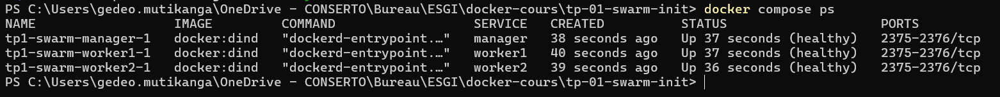
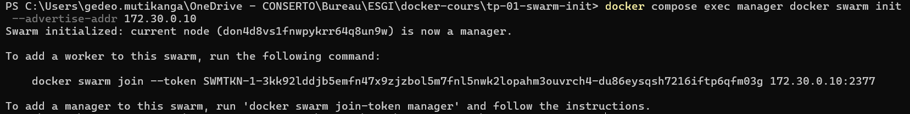
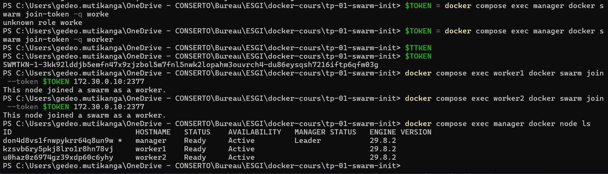
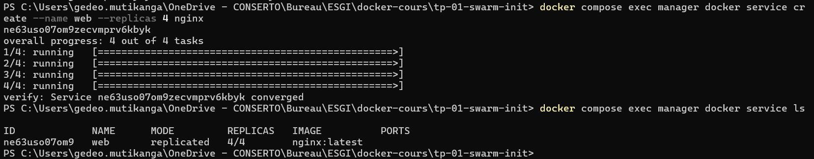
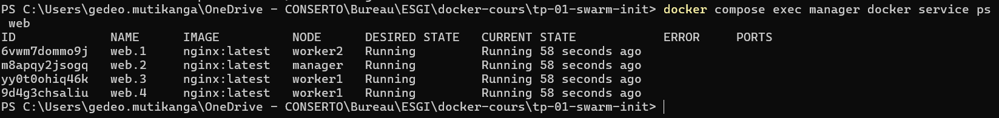
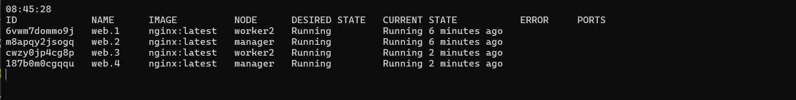
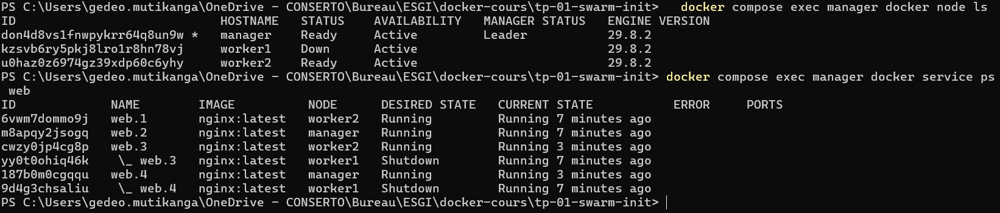
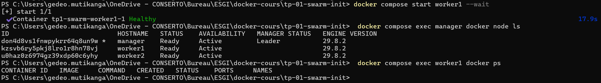
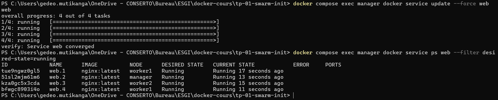

# TP 1 – Swarm 3 nœuds + résilience

Compte rendu du TP [Swarm 3 nœuds + résilience](https://app.notion.com/p/sysentive/TP-1-Swarm-3-n-uds-r-silience-3f0a84550c76801eae1bdb572af32657) (sysentive.link/tp-1-swarm).

- **Objectif :** monter un Swarm de 3 nœuds (1 manager, 2 workers), y déployer `web` (nginx, 4 réplicas), arrêter un worker et vérifier que Swarm replanifie les tâches perdues.
- **Date :** 07/10/2026
- **Résultat :** les 4 réplicas ont été restaurés **15,7 s** après l'arrêt du worker, dont 9,9 s pour détecter la panne.

## Contenu du dossier

| Fichier | Rôle |
|---|---|
| `compose.yaml` | Les 3 « machines » du cluster (nœuds Docker-in-Docker) |
| `cluster-status-before.txt` | Livrable : nœuds, service et répartition des tâches **avant** la panne |
| `cluster-status-after.txt` | Livrable : même chose **après** l'arrêt de `worker1` |
| `service-ps.txt` | Livrable : historique complet des tâches du service `web` (`docker service ps`) |
| `captures/` | Captures d'écran de mon terminal PowerShell, étape par étape (`01` à `09`), et horodatages précis de la panne (`06-chronologie-panne.txt`) |

Toutes les commandes ont été tapées dans **Windows PowerShell**, depuis le dossier du TP.

---

## 1) Topologie du cluster

Je n'avais pas 3 machines à disposition. J'ai donc utilisé l'option **DinD (Docker-in-Docker)** prévue par l'énoncé : chaque « machine » est un conteneur `docker:dind` privilégié qui fait tourner son propre Docker Engine. Les 3 nœuds sont décrits dans [`compose.yaml`](compose.yaml).

| Nœud | Rôle Swarm | IP (`swarm-net`) | OS | Docker Engine |
|---|---|---|---|---|
| `manager` | Manager (Leader) | 172.30.0.10 | Alpine Linux | 29.8.2 |
| `worker1` | Worker | 172.30.0.11 | Alpine Linux | 29.8.2 |
| `worker2` | Worker | 172.30.0.12 | Alpine Linux | 29.8.2 |

**Hôte :** Windows 11 Enterprise et Docker Desktop (WSL2), linux/amd64.

Points clés de `compose.yaml` :

- **`privileged: true`** est indispensable pour faire tourner un `dockerd` dans un conteneur.
- **`DOCKER_TLS_CERTDIR: ""`** désactive le TLS du daemon interne. C'est acceptable ici parce qu'**aucun port n'est publié sur l'hôte** : les daemons ne sont joignables que depuis le réseau `swarm-net`. Les ports `2375-2376/tcp` affichés par `docker compose ps` sont seulement *exposés* par l'image, pas publiés.
- Les nœuds ont des **IP fixes** sur `172.30.0.0/24`, un sous-réseau qui n'était utilisé par aucun autre réseau Docker de la machine.
- Un **healthcheck** (`docker info`) permet à `docker compose up --wait` d'attendre que les 3 `dockerd` internes soient prêts.
- Les 3 nœuds partagent la même définition grâce à une ancre YAML (`&node`).

```powershell
docker compose up -d --wait
docker compose ps
```



---

## 2) `docker swarm init` sur le manager

Commande exacte :

```powershell
docker compose exec manager docker swarm init --advertise-addr 172.30.0.10
```



`--advertise-addr` fixe l'adresse que le manager annonce aux autres nœuds pour le plan de contrôle (port 2377).

## 3) `docker swarm join` sur les 2 workers

Le worker-token se récupère sur le manager avec `docker swarm join-token worker` (`-q` pour n'afficher que le token) :

```powershell
$TOKEN = docker compose exec manager docker swarm join-token -q worker
docker compose exec worker1 docker swarm join --token $TOKEN 172.30.0.10:2377
docker compose exec worker2 docker swarm join --token $TOKEN 172.30.0.10:2377
docker compose exec manager docker node ls
```



Les 3 nœuds sont `Ready`, et le manager est `Leader`. Les premières lignes de la capture montrent une faute de frappe (`worke`), corrigée à la commande suivante.

---

## 4) Création du service `web` (4 réplicas)

```powershell
docker compose exec manager docker service create --name web --replicas 4 nginx
docker compose exec manager docker service ls
```



Le service a convergé (`verify: Service … converged`), et `docker service ls` affiche **4/4**.

## 5) Répartition initiale

Livrable : [`cluster-status-before.txt`](cluster-status-before.txt)



| Nœud | Tâches |
|---|---|
| `manager` | `web.2` |
| `worker1` | `web.3`, `web.4` |
| `worker2` | `web.1` |

> Le manager reçoit lui aussi une tâche : par défaut, un manager est `Availability: Active` et sert également de worker. En production, on le passerait en `drain` (`docker node update --availability drain manager`) pour le réserver à l'orchestration. Je l'ai laissé tel quel pour coller à l'énoncé.

---

## 6) Simulation de la panne

J'ai arrêté **`worker1`**, le nœud qui portait le plus de tâches (2 sur 4). Dans le montage DinD, arrêter le conteneur revient à éteindre la machine : son `dockerd` et ses conteneurs nginx s'arrêtent.

```powershell
docker compose stop worker1
```

Dans un second terminal, une boucle affichait toutes les 2 s les tâches actives du service :

```powershell
while (1) { cls; date -f HH:mm:ss; docker compose exec manager docker service ps web --filter=desired-state=running; sleep 2 }
```



À 08:45:28 (heure locale), les 4 tâches tournent uniquement sur `manager` et `worker2`. Les horodatages précis viennent ensuite de `docker inspect`, appliqué au conteneur `worker1`, au nœud et aux 2 nouvelles tâches : voir [`captures/06-chronologie-panne.txt`](captures/06-chronologie-panne.txt).

## 7) État du service après la panne

Livrables : [`cluster-status-after.txt`](cluster-status-after.txt) et [`service-ps.txt`](service-ps.txt)



- `worker1` est **`Down`**.
- Ses deux tâches, `web.3` et `web.4`, sont passées en *desired state* **`Shutdown`** (lignes `\_`).
- Swarm a créé deux nouvelles tâches pour les mêmes slots : `web.3` sur `worker2` et `web.4` sur `manager`.
- Il y a bien **4 tâches actives**, réparties 2 sur `manager` et 2 sur `worker2`.

---

## 8) Analyse

### Les 4 réplicas ont-ils été restaurés ? En combien de temps ?

**Oui.** Les 4 réplicas sont revenus à l'état `Running` sur `manager` et `worker2` **15,7 s** après l'arrêt effectif de `worker1` :

| Heure (UTC) | Événement | Délai |
|---|---|---|
| 06:42:39.9 | `worker1` arrêté | t = 0 |
| 06:42:49.9 | Le manager déclare `worker1` **Down** et crée 2 tâches de remplacement | **+9,9 s** (détection) |
| 06:42:55.7 | Les 2 nouvelles tâches sont `Running`, le service est de nouveau à 4 réplicas actifs | **+15,7 s** |

1. **Détection (9,9 s).** Les workers envoient des heartbeats au manager toutes les 5 s (`dispatcher heartbeat period`). Le manager attend quelques heartbeats manqués avant de déclarer le nœud `Down`.
2. **Replanification (5,8 s).** Dès que le nœud est `Down`, l'orchestrateur constate qu'il manque 2 tâches sur 4 et les crée aussitôt, à la même milliseconde. Il les place sur les nœuds `Ready` qui en ont le moins. Le reste du délai correspond au démarrage des conteneurs, l'image `nginx` étant déjà en cache sur ces nœuds.

Un premier essai, le 05/10, avait donné un résultat cohérent : 17,6 s, dont 9,3 s de détection.

Pendant la panne, le service n'a jamais été complètement indisponible : 2 réplicas sur 4 tournaient toujours. Avec un port publié via le routing mesh, le trafic aurait continué d'être servi par ces 2 réplicas.

### Écart observé : `REPLICAS 6/4`

Après la panne, `docker service ls` affiche **`6/4`** (voir [`cluster-status-after.txt`](cluster-status-after.txt)). Comme `worker1` s'est arrêté sans pouvoir le signaler au manager, la dernière valeur connue du *current state* de ses tâches reste `Running` (on le voit dans la colonne CURRENT STATE de la capture 07), et le compteur les compte encore. Pourtant, leur *desired state* est bien `Shutdown`. Il s'agit seulement d'un artefact d'affichage : `--filter desired-state=running` ne liste que 4 tâches. Le compteur revient à `4/4` dès que `worker1` se reconnecte et confirme l'arrêt.

### Bonus : retour de `worker1`

```powershell
docker compose start worker1 --wait
docker compose exec manager docker node ls
docker compose exec worker1 docker ps
```



Après le redémarrage, le nœud repasse `Ready`, mais **aucune tâche n'y revient** : `docker ps` sur `worker1` est vide. Swarm ne rééquilibre pas automatiquement un service déjà à 4/4, pour ne pas interrompre des conteneurs qui fonctionnent.

Pour rééquilibrer, il faut forcer un redéploiement progressif (*rolling update*) :

```powershell
docker compose exec manager docker service update --force web
docker compose exec manager docker service ps web --filter desired-state=running
```



Après cette commande, `worker1` a récupéré 2 tâches (`web.1` et `web.4`), `manager` et `worker2` en gardent une chacun.

### Que se passerait-il si on avait perdu le Manager à la place ?

Ce cluster n'a **qu'un seul manager**, donc aucune tolérance de panne côté orchestration :

- **Les conteneurs déjà lancés continuent de tourner** sur les workers. Le plan de données (conteneurs, réseau overlay, routing mesh sur les workers) ne dépend pas du manager à chaque instant. Ici, la tâche `web.2` qui tournait sur le manager serait perdue avec lui, et il resterait 3 réplicas sur 4.
- **En revanche, le plan de contrôle est perdu.** Plus aucune commande `docker service …` ni `docker node …` n'est possible, car les workers refusent les commandes de gestion (*This node is not a swarm manager*). La tâche perdue **ne serait pas replanifiée**, puisque c'est le manager qui fait la réconciliation. Une autre panne de worker ne serait plus compensée non plus. Enfin, impossible de mettre à jour, scaler ou déployer.
- **Pour s'en sortir :** redémarrer le manager si son état Raft (`/var/lib/docker/swarm`) est intact. Sinon, recréer un cluster avec `docker swarm init --force-new-cluster` à partir d'une sauvegarde de ce dossier, puis refaire rejoindre les workers.
- **La bonne pratique** consiste à prévoir **3 managers** (ou 5). Swarm utilise le consensus **Raft**, qui exige une majorité (quorum) de managers disponibles : avec 3 managers, le cluster supporte la perte de 1 ; avec 5, la perte de 2. Si le leader tombe, les managers restants élisent un nouveau leader en quelques secondes et la replanification continue. Un nombre pair de managers n'apporte rien : 4 managers tolèrent toujours une seule panne.

---

## Écarts par rapport à l'énoncé

- **Machines :** 3 conteneurs DinD sur un seul hôte Windows au lieu de 3 VMs. Le Swarm est réel (3 Docker Engines distincts, chacun avec son propre état), mais une panne de l'hôte ferait tomber les 3 nœuds en même temps.
- **Méthode de panne :** `docker compose stop worker1` sur le conteneur DinD. Cela équivaut à un arrêt de la machine : le daemon et ses conteneurs s'arrêtent ensemble.
- **Docker Compose** sert uniquement à provisionner les 3 machines. On ne peut pas y décrire le Swarm lui-même (`init`, `join`), qui se fait avec la CLI, et le service `web` est créé avec `docker service create`, comme le demande l'énoncé. Pour décrire des services Swarm dans un fichier, il faudrait un fichier de **stack**, au même format compose, déployé avec `docker stack deploy`.
- **Token visible :** le worker-token apparaît en clair sur les captures 02 et 03. Il ne permet de rejoindre que ce cluster de test, joignable uniquement depuis le réseau Docker local `swarm-net`.
- Aucun port n'a été publié sur l'hôte, donc aucun conflit avec les ports déjà occupés sur ma machine.

## Reproduire / nettoyer

```powershell
docker compose up -d --wait                                   # 3 nœuds healthy
docker compose exec manager docker swarm init --advertise-addr 172.30.0.10
$TOKEN = docker compose exec manager docker swarm join-token -q worker
docker compose exec worker1 docker swarm join --token $TOKEN 172.30.0.10:2377
docker compose exec worker2 docker swarm join --token $TOKEN 172.30.0.10:2377
docker compose exec manager docker service create --name web --replicas 4 nginx
docker compose stop worker1                                   # panne

docker compose down -v                                        # supprime nœuds, réseau et volumes /var/lib/docker
```

L'environnement est laissé en place pour la correction.
